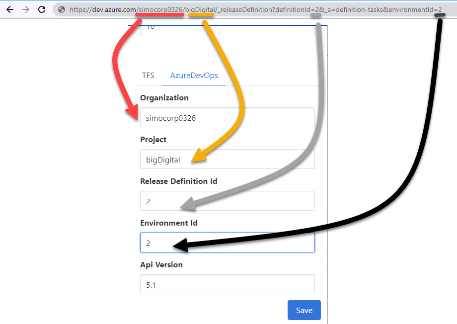

# TFS | Azure Devops Desktop Release Notifier

A lightweight tantalizing desktop notifier for TFS or Azure Devops releases.

## Installation

Run the installer file `yuarppSetup.exe` 

## Configuration

Reposition the application onto the visible area of the windows systems tray

Right click the application and invoke > Configure

Complete the required details as follows:

### AzureDevops configuration

The following things are requied:
- Username - This is your AzureDevops username
- PAT - This is the Personal Access Token (PAT).  This can be generated by following the steps below:

1. Login to AzureDevops
2. Click on the User Settings icon (top right)
3. Select the Personal Access Tokens menu item
4. Click the New Token button
5. Create a new token using only the Release > Read scope
6. Click the create button and copy + paste the generated token into the PAT field

[more information here](https://docs.microsoft.com/en-us/azure/devops/organizations/accounts/use-personal-access-tokens-to-authenticate?view=azure-devops&tabs=preview-page)

- The remaining fields relate to your Azure instance/Release definition:

### TFS configuration

You will need to specify the following details:
- Username - This is your TFS username (include domain name)
- PAT - This is the Personal Access Token (PAT).  This can be created by following the instructions outlined [on to this page](https://gist.github.com/julienstroheker/f452b27927337e97cf2ac9f7262cdadc) (NOTE: Do not use All scopes, only select Release (Read) scope)

https://gist.github.com/julienstroheker/f452b27927337e97cf2ac9f7262cdadc

### Other configurable items

- Poll Interval - How often a call to either TFS or AzureDevops is made. Default is 60000 => 1 minute
- Failed threshold - specifiy the maximum number of failed attempts before giving up

### Local builds

Execute `npm run make-windows`

### Create Installer

In order to generate the windows installer, run the following commands

`npm run make-windows`

`npm run windows-installer`

The installation package will be created in the `./tmp/build/installer64` folder

### Tests
Run the tests by invoking the following commands:

`npm run tests`

### Acknowledgements

All icons in `.\images` sourced from https://icons8.com/

poller.js obtained from https://gist.github.com/gadflying/736cd08dd56e14bc29a329524db06cc9

